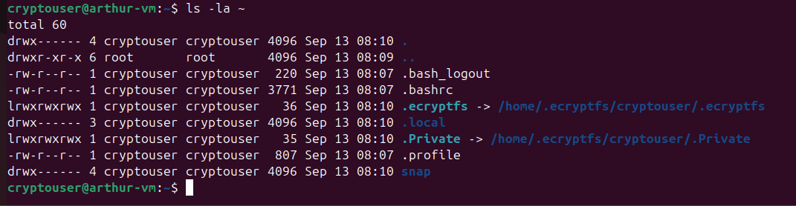
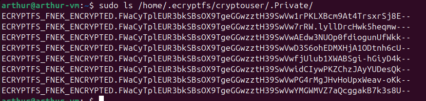
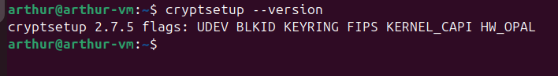
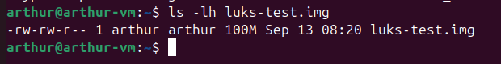
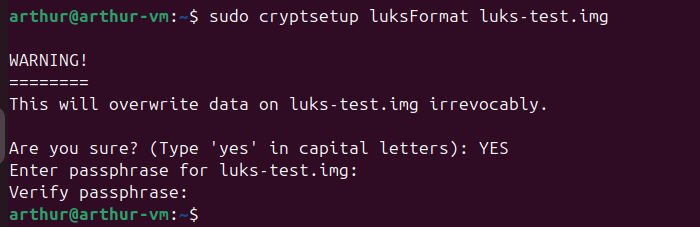
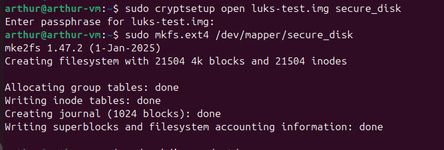
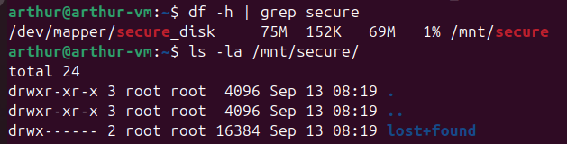
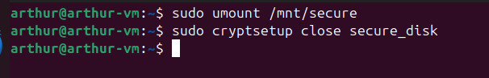

# Домашнее задание: «Защита хоста»

## Задание 1

Установил eCryptfs и создал пользователя `cryptouser`.  
Домашний каталог был успешно зашифрован.

### Скриншоты
1. Вид под пользователем `cryptouser` (читаемые файлы):  

2. Вид из-под root в `/home/.ecryptfs/cryptouser/.Private` (зашифрованные имена):  

## Задание 2

Установил поддержку `LUKS`, создал раздел 100 Мб и зашифровал его с помощью `cryptsetup`.

### Скриншоты
1. Установка cryptsetup и проверка версии:  

2. Создание виртуального раздела 100 Мб:  

3. Инициализация LUKS (`luksFormat`):  

4. Открытие раздела и создание файловой системы ext4:  

5. Монтирование и проверка содержимого (`lost+found`):  

6. Размонтирование и закрытие раздела:  

